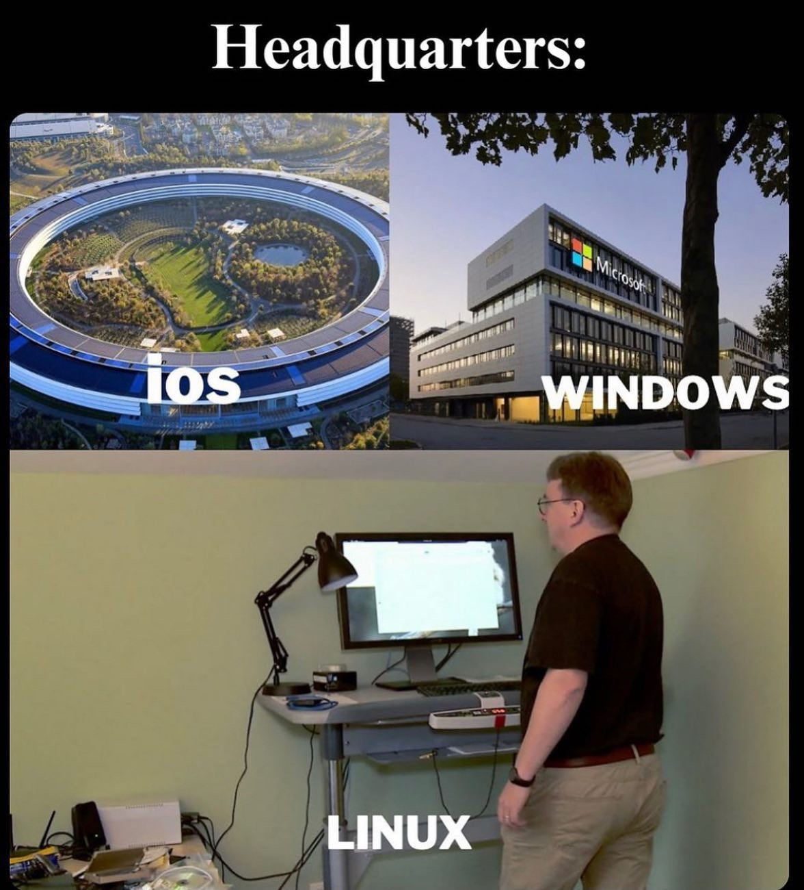

# Mini Corso per Linux day al liceo Copernico in data 25 Ottobre 2025

Workshop linux tenuto da ing. Alessandro Morandi 
https://abeatbeyond.com


Programma Linux day : http://copebo.altervista.org/linuxday2025/#programma


## Guida da seguire per Linux Workshop


1. Crea un account github con una mail personale ( probabilmente la scuola sta bloccando la tua mail di istituto )

2. Vai al link di questo progetto: 

    https://github.com/abeatbeyondlab/linux-day-25-ottobre-2025-copernico-bologna-workshop-linux

3. Clicca sul bottone verde "Code"
4. clicca su "Create codespace on main"

    

5. Quindi sei dentro il progetto con gli script

    
6. In basso vedi il terminale linux. Se digiti nel terminale 

    `lsb_release -a`

    e poi premi invio, vedrai una risposta del terninale che dice la versione di linux installata all'interno dello spazio Github Codespace . in questo caso abbiamo Ubuntu 24

    

7. esistono diverse distribuzioni linux, quella che abbiamo aperto è solo una delle tante. Per vedere tutte quelle che ci sono puoi andare sul sito distrowatch

    https://distrowatch.com/

8. Torniamo ora dentro il notro spazio "codespace" dove abbiamo un editor di testoc he si chiama visual studio che ci permette di lavorare sui file e di avere un terminale linux. Cominciamo digitando nel terminale un comando che ci creerà una cartella con dei file che useremo per imparare a usare linux. Quindi digitare nel terminale 

    ```bash
    chmod +x prepara_ambiente_per_test.sh && ./prepara_ambiente_per_test.sh
    ```

    

    Premendo invio comparirà una cartella chiamata linux_esercizi che vederemo nel file explorer dell'editor di testo Visual Studio Code

9. Ora possiamo divertirci con i coandi base di linux. Apri il file `_esercizi_comandi_base.sh` e copia i comandi che trovi nel terminale, poi premi invio e vedi cosa succede

10. Se vuoi cimentarti con i permessi su file e directory puoi guardare le mini guide e cimentarti con `_esercizi_permessi.sh`

11. Se vuoi collegarti con una tua macchina linux puoi fare in diversi modi 
    - provare linux nel browser -> https://webvm.io/
    - installare ubuntu desktop
        - https://www.youtube.com/watch?v=LZHXNUT72L0
        - https://ubuntu.com/tutorials/install-ubuntu-desktop#1-overview

    - creare una macchina virtuale in cloud e collegarsi con ssh
        - NETCUP -> https://www.netcup.com/en/server/vps
        - HERTZNER -> https://www.hetzner.com/cloud
        - DIGITALOCEAN -> https://www.digitalocean.com/pricing/droplets


